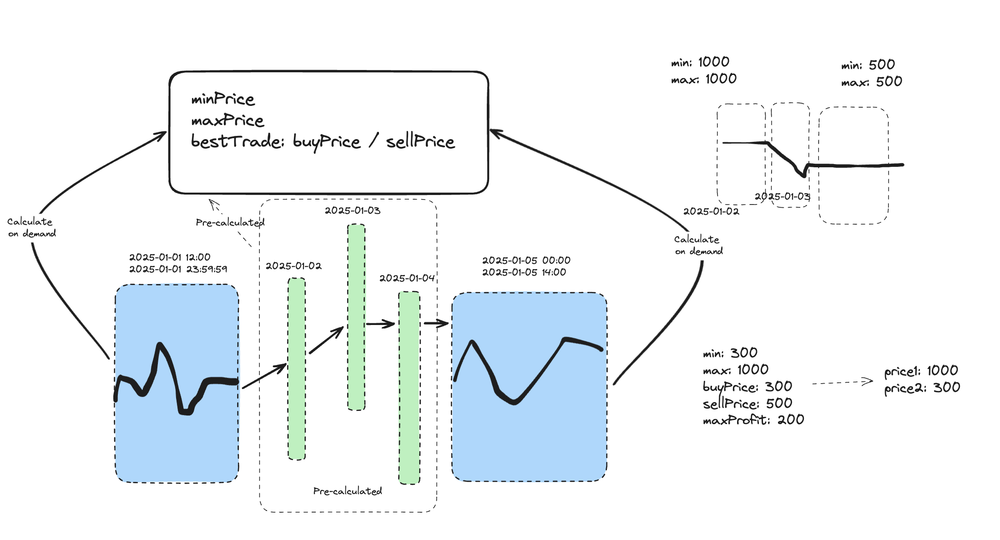

# Description

The solution provides the ability to get the best BTC trade for 2018-MAY.

Deployed @ https://q6tj4qnuxv.eu-west-1.awsapprunner.com/

# Approach



BTC price and timestamps are stored as JSON order by timestamp in ASC order. Data has been gathered from [here](https://github.com/Nucs/cryptocurrency-ticks-data/tree/master/data/BTCUSDT) and transformed with the `backend/scripts/process-bitcoin-price.js` script. Each file holds the date for a single data, e.g. `2018-05-16`

On boot time we process the data for BTC/USD price and build the daily candles. The candles are cached in memory. We have the following details for each candle:

```javascript
{
  // best buy time & price
  buyTime: '2025-03-01T01:00:00Z',
  buyPrice: '14000',
  // best sell time & price
  sellTime: '2025-03-01T04:00:00Z',
  sellPrice: '18000',
  maxProfit: '4000',
  // max price and the time it happened
  maxPrice: '18000',
  maxTime: '2025-03-01T04:00:00Z',
  // min price and the time it happened
  minPrice: '12000',
  minTime: '2025-03-01T05:00:00Z',
}
```

When a request comes in we split it into 3 parts:
1. from the beginning of range until end of day - we fetch the date for this date and do the calculation for this part
1. all other days - we load the daily candles from cache
1. from the beginning of last day until end of range -  we fetch the date for this date and do the calculation for this part

As next step we gather the trade info for each of the 3 parts above and do another calculation based on min/max for each part. The idea is to calculate the max profit by considering min price in previous period. 

When we do this we store the best trade and then we compare it with each of the parts above. If there's a better trade within any of the parts we take override it. 

The implementation takes in consideration the requirement about earliest and shortest trade.

# Things that I would improve
1. Generally I'd introduce more granular candles, e.g. hourly, daily, weekly and implement a logic which leverages these based on the requested range. 
2. More tests with more test data

# Production ready features
1. Request Storage Middleware
    - add request id to `x-request-id` header
    - add request id to the `AsyncContext` so it's accessible for the Http Logger
1. Http Logger
    - attaches `requestId` to each log
1. Global interceptor
    - logs request and response
    - logs duration of the request
    - enforce request timeout of 30 seconds
1. Global Exception Handler
    - catches all errors with proper logging + request id
    - propagates all handled requests to the response 
    - hide unhandled errors and returns 500
1. Healthcheck & Liveness endpoints
    - healthcheck endpoint shows that the app is up running and everything has been resolved - in other words we have had successful boot
    - liveness endpoint - it's usefull to detect if the app is still responding
1. Dockerfile 
    - multi staged build which combines frontend app with the backend app
1. In-memory caching mechanism 
    - Caching for daily candles
    - Caching for requests when getting trade info for the same range. TTL set to 10s
1. BigNumber.js
    - all calculations are done with BigNumber.js to ensure accuracy and avoid JS precision flows
1. App version is shown on the FE
    - we show the version on the UI
    - ideally we could add it to response headers as well
1. Response DTO + `exclude-all` serialize options
    - `/trade/` endpoint returns only properties that have been decorated with @Expose() on the dto. 
    - all prices are returned as string so we don't lose precision

# Deployment
1. App is deployed on AWS App Runner with 1 vCPU + 2 GB RAM @ https://q6tj4qnuxv.eu-west-1.awsapprunner.com/ 
1. Latest Docker image is available @ `public.ecr.aws/k6f1t2n7/vlad-the-lad:latest` - it contains all the data for BTC prices
    - container can be inspected with the following command
```bash
$ docker run -it --entrypoint /bin/bash public.ecr.aws/k6f1t2n7/vlad-the-lad:latest
```

